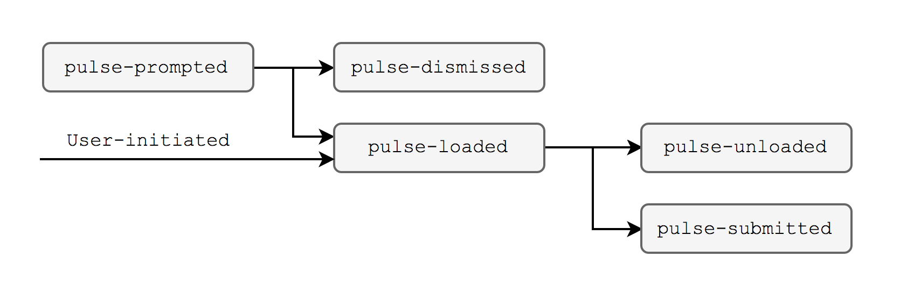

[👈 Back to README](../README.md)

# Metrics

A summary of the metrics the Pulse add-on will record.


## Definitions

* **Survey**: a short survey collecting user sentiment and rationale.
* **Report**: a full payload of information, combining both survey and measured data.
* **Page**: the page from which the survey was intiated.
* **Session**: a group of one or more pages from the same hostname in a contiguous browsing session.


## Lifecycle

The Pulse lifecycle begins when one of two things happen:

1. The user is prompted to begin with a [`<notificationbox>`](https://developer.mozilla.org/docs/Mozilla/Tech/XUL/notificationbox).
2. The user initiates the process through a [WebExtension `pageAction`](https://developer.mozilla.org/Add-ons/WebExtensions/API/pageAction).

The user is then presented with a short survey. Once submitted, it is augmented with information about the browser, page, and session. Once compiled, the report is sent to the Test Pilot add-on, which forwards it to [Unified Telemetry](https://wiki.mozilla.org/Unified_Telemetry) and [Ping Centre](https://github.com/mozilla/ping-centre) for analysis.




## Analysis

### Performance

The primary research question Pulse is trying to answer: at what threshold does performance impact a user’s satisfaction? There are a number of interesting ways that this can be measured and analyzed, foremost a multivariate analysis of covariance to uncover which performance factors most affect user sentiment.

Some interesting questions that could be answered by such an analysis:

- At what point does page weight affect user satisfaction?
- How does an ad-blocker affect user satisfaction? What specifically does it do that makes users happy or unhappy?
- At what point do the number of add-ons affect user satisfaction and speed?
- On which sites do users report the most problems?
- To what extent can users perceive the impact of e10s and multiple content processes?


### Experiment Health

With a clear funnel and bounce/conversion definitions, the health

- Can users be compelled to report positive experiences as well as negative ones?
- How sticky is Pulse? How do conversion rates change over time?
- What types of prompts are most effective?

These analyses can inform more directed future studies (site-specific, users with specific add-ons, etc).


### Compatibility

Specific reports might be able to be passed on to the Web Compatability team for futher triage.


## Collection

### `pulse-prompted`

Fired whenever the user is prompted to provide feedback.

**Properties:**

- `type`: string indicating why the user was prompted. See [Appendix A] for more information.

```js
{
  "event": "pulse-prompted",
  "type": "random"
}
```


### `pulse-dismissed`

Fired whenever the user dismisses a feedback prompt.

**Properties:**

- `type`: string indicating why the user was prompted. See [Appendix A] for more information.

```js
{
  "event": "pulse-dismissed",
  "type": "random"
}
```


### `pulse-loaded`

Fired whenever the survey is opened, whether in a tab or page action doorhanger. After `pulse-loaded` is fired, will be followed by either `pulse-unloaded` (i.e. a bounce) or `pulse-submitted` (i.e. a conversion).

**Properties:**

- `type`: string indicating why the user was prompted. See [Appendix A] for more information.
- `id`: string containing a [v4 UUID] for the submission. The same ID will be included with the resultant `pulse-unloaded` or `pulse-submitted` ping.

```js
{
  "event": "pulse-loaded",
  "id": "aaaaaaaa-bbbb-cccc-dddd-eeeeeeeeeeee",
  "type": "random"
}
```


### `pulse-unloaded`

Fired whenever the survey is closed without being submitted.

**Properties:**

- `type`: string indicating why the user was prompted. See [Appendix A] for more information.
- `id`: string containing a [v4 UUID] for the submission. The ID will be identical to the preceding `pulse-loaded` ping.

```js
{
  "event": "pulse-unloaded",
  "id": "aaaaaaaa-bbbb-cccc-dddd-eeeeeeeeeeee",
  "type": "random"
}
```


### `pulse-submitted`

Fired upon successful submission of the survey containing the survey data augmented with data gathered about the browser, page, and session.

**Properties:**

- `type`: string indicating why the user was prompted. See [Appendix A] for more information.
- `id`: string containing a [v4 UUID] for the submission. The ID will be identical to the preceding `pulse-loaded` ping.
- `sentiment`: number indicating the user's feeling about the current page, scored on a five-point Likert scale, i.e. between `1` and `5`, inclusive.
- `reason`: string indicating the reason the user feels the way they indicated in the `sentiment`. Possible values tentatively `fast`, `slow`, `works`, `broken`, `like`, `dislike`, and `other`.
- `details`: string or `null` containing additional details about why the user feels the way they indicated in `sentiment` and `reason`, entered into an open textarea.
- `telemetryId`: a string containing a [v4 UUID] with the user's telemetry ID, retrieved from `toolkit.telemetry.cachedClientID`.
- `platform`: a string containing the name of the operating system, one of the [`OS_TARGET`](https://developer.mozilla.org/docs/Mozilla/Developer_guide/Build_Instructions/OS_TARGET) values.
- `language`: a string containing the user's preferred language, gotten from [`navigator.language`](https://developer.mozilla.org/docs/Web/API/NavigatorLanguage/language) on the survey's tab.
- `version`: a string containing the version of Firefox, gotten from [`system.version`](https://developer.mozilla.org/Add-ons/SDK/High-Level_APIs/system#version).
- `channel`: a string containing the Firefox release channel, one of `nightly`, `developer`, `beta`, or `release`.
- `addons`: an array of strings listing the IDs of the user's enabled add-ons.
- `adBlocker`: a boolean indicating whether the user has installed and enabled an add-on known to block ads. See [Appendix B] for more information.
- `trackingProtection`: a boolean indicating whether tracking protection is enabled.
- `openTabs`: a number indicating the count of open tabs across the browser.
- `openWindows`: a number indicating the count of open windows across the browser.
- `e10s`: a number indicating the number of content processes, retrieved from `dom.ipc.processCount`.
- `hangs`: a TBD measurement of the number of hangs across the browser. Likely to be split into child and main processes.
- `timestamp`: a number containing a Unix timestamp from which the page request began.
- `hostname`: a string indicating the hostname of the page request, as reported by `window.location.hostname`.
- `protocol`: a string indicating the protocol used to retrieve the page, as reported by `window.location.protocol`.
- `timerContentLoaded`: the number of milliseconds between the start of the page load and the `DOMContentLoaded` event.
- `timerWindowLoad`: the number of milliseconds between the start of the page load and the `load` event on `window`.
- `timerFirstPaint`: the number of milliseconds between the start of the page load and the first paint.
- `timerFirstInteraction`: the number of milliseconds between the start of the page load and the first of the following events: `click`, `touch`, `scroll`, `keypress`. `null` if none of these events took place.
- `timerFirstByte`: the number of milliseconds between the start of the request and the time the first byte was received.
- `requests`: an object containing information about requests spawned by the page. Each member key indicates the type of request, categorized as [`webRequest.ResourceType`s](https://developer.mozilla.org/Add-ons/WebExtensions/API/webRequest/ResourceType):

  * `beacon`
  * `csp_report`
  * `font`
  * `image`
  * `imageset`
  * `main_frame`
  * `media`
  * `object`
  * `other`
  * `ping`
  * `script`
  * `stylesheet`
  * `sub_frame`
  * `web_manifest`
  * `websocket`
  * `xbl`
  * `xml_dtd`
  * `xmlhttprequest`
  * `xslt`
  
  With one special value:

  * `all`: all requests of all types, summed.
  
  Each value of the object contains three data points:

  * `num`: the number of requests of that type.
  * `cached`: the proportion of requests of that type that were read from cache.
  * `cdn`: the proportion of requests of that that were retrieved from a CDN.
  * `time`: the time it took to load those files.

- `disconnectRequests`: the number of requests made to hosts on the [disconnect.me tracking protection blocklist](https://disconnect.me/trackerprotection).
- `consoleErrors`: the number of errors logged to the browser console.
- `engagement`: a number indicating the engagement score for the page. See [Appendix C] for more information.
- `sessionSize`: the number of page visits in the session.
- `sessionLength`: the number of milliseconds elapsed in a session.
- `sessionTimerContentLoaded`: an [aggregation] of `timerContentLoaded` across the session.
- `sessionTimerWindowLoad`: an [aggregation] of `timerWindowLoad` across the session. 
- `sessionTimerFirstPaint`: an [aggregation] of `timerFirstPaint` across the session.
- `sessionTimerFirstInteraction`: an [aggregation] of `timerFirstInteraction` across the session.
- `sessionTimerFirstByte`: an [aggregation] of `timerFirstByte` across the session.
- `sessionRequests`: an object containing an [aggregation] of each type of request spawned by pages across the session.
- `sessionEngagement`: an [aggregation] of `engagement` across the session.

```js
{
  "event": "pulse-report",
  "type": "user",
  "id": "aaaaaaaa-bbbb-cccc-dddd-eeeeeeeeeeee",
  "sentiment": 3,
  "reason": "slow",
  "details": null,
  "telemetryId": "aaaaaaaa-bbbb-cccc-dddd-eeeeeeeeeeee",
  "platform ": "Darwin",
  "language": "en-US",
  "version": "52.0a2",
  "channel": "developer",
  "addons": [
    "@testpilot-addon",
    "@min-vid",
    "pulse@mozilla.com"
  ],
  "adBlocker": true,
  "trackingProtection": true,
  "openTabs": 11,
  "openWindows": 1,
  "e10s": 3,
  "hangs": 0,
  "timestamp": 1485394950697,
  "hostname": "testpilot.firefox.com",
  "protocol": "https:",
  "timerContentLoaded": 110,
  "timerWindowLoad": 190,
  "timerFirstPaint": 80,
  "timerFirstInteraction": 1300,
  "timerFirstByte": 19,
  "requests": {
    "all":            { "num": 1, "cached": 0.123, "cdn": 0.4, "time": 274 },
    "main_frame":     { ... },
    "sub_frame":      { ... },
    "stylesheet":     { ... },
    "script":         { ... },
    "image":          { ... },
    "object":         { ... },
    "xmlhttprequest": { ... },
    "xbl":            { ... },
    "xslt":           { ... },
    "ping":           { ... },
    "beacon":         { ... },
    "xml_dtd":        { ... },
    "font":           { ... },
    "media":          { ... },
    "websocket":      { ... },
    "csp_report":     { ... },
    "imageset":       { ... },
    "web_manifest":   { ... },
    "other":          { ... }
  },
  "disconnectRequests": 17,
  "consoleErrors": 7,
  "engagement": 77.9,
  "sessionSize": 24,
  "sessionLength": 1411080,
  "sessionTimerContentLoaded": {
    "num": 24,
    "total": 2640,
    "deciles": [ 29, 49, 86, 94, 101, 110, 129, 145, 243 ]
  },
  "sessionTimerWindowLoad": {
    "num": 24,
    "total": 4560,
    "deciles": [ 94, 119, 135, 150, 165, 180, 199, 240, 390 ]
  },
  "sessionTimerFirstPaint": {
    "num": 24,
    "total": 1920,
    "deciles": [ 25, 34, 44, 56, 70, 77, 84, 134, 178 ]
  },
  "sessionTimerFirstInteraction": {
    "num": 21,
    "total": 31200,
    "deciles": [ 619, 811, 939, 1123, 1300, 1750, 3400, 5700, 10340 ],
    "null": 3
  },
  "sessionTimerFirstByte": {
    "num": 24,
    "total": 744,
    "deciles": [ 18, 23, 26, 30, 31, 34, 37, 44, 59 ]
  },
  "sessionRequests": {
    "all":   {
      "num": {
        "num": 24,
        "total": 30,
        "deciles": [ 1, 1, 1, 1, 1, 1, 1, 2, 4 ]
      },
      "cached": {
        "num": 24,
        "mean": 0.14,
        "deciles": [ 0.01, 0.04, 0.1, 0.12, 0.14, 0.21, 0.40, 0.56, 0.81 ]
      },
      "cdn": {
        "num": 24,
        "mean": 0.33,
        "deciles": [ 0.12, 0.15, 0.19, 0.22, 0.34, 0.41, 0.47, 0.49, 0.55 ]
      },
      "time": {
        "num": 24,
        "total": 6576,
        "deciles": [ 165, 182, 214, 244, 274, 333, 356, 420, 513 ]
      }
    },
    "main_frame":     { ... },
    "sub_frame":      { ... },
    "stylesheet":     { ... },
    "script":         { ... },
    "image":          { ... },
    "object":         { ... },
    "xmlhttprequest": { ... },
    "xbl":            { ... },
    "xslt":           { ... },
    "ping":           { ... },
    "beacon":         { ... },
    "xml_dtd":        { ... },
    "font":           { ... },
    "media":          { ... },
    "websocket":      { ... },
    "csp_report":     { ... },
    "imageset":       { ... },
    "web_manifest":   { ... },
    "other":          { ... }
  },
  "sessionEngagement": {
    "num": 24,
    "total": 1512,
    "deciles": [ 23, 40, 49, 50, 63, 72, 84, 88, 94 ]
  }
}
```


## Appendices

### Appendix A: Types

Each ping contains a `type` field indicating the action precipitating the entrance to the feedback funnel. This is always a string, and will be one of the following values:

- `user`: user-initiated feedback, started by clicking the pulse icon in the page action.
- `random`: users are randomly prompted to provide feedback no more than once per day.

This list is not exhaustive; more directed studies will be added as the experiment progresses. Unless otherwise specified, this prompting happens in a high-priority [`<notificationbox`](//developer.mozilla.org/docs/Mozilla/Tech/XUL/notificationbox) element.


### Appendix B: Ad-blockers

In some properties, Pulse attempts to determine if the user has installed an ad-blocker. This is determined by comparing against [a list](https://github.com/mozilla/pulse/blob/master/src/measurements/ad-blocker.js) of add-ons from the AMO 'Security and Privacy' category with more than 25,000 users. This list is not considered exhaustive.

Additionally, the Test Pilot [Tracking Protection](https://testpilot.firefox.com/experiments/tracking-protection) experiment is considered to be an ad-blocking extension.


### Appendix C: Engagement

A normalized score tracking a user's engagement to the page; specifics are to be determined, but this will likely be similar to the [Chromium Site Engagement](//www.chromium.org/developers/design-documents/site-engagement) metric. Number, between `0.0` and `100.0`.


### Appendix D: Aggregated Properties

To provide more insight into numbers aggregated across multiple pages, some fields are reported as an object containing the count, sum, mean, number of null values, and decile partitions, e.g.

```json
{
    "num": 125,
    "total": 151304,
    "mean": 1210.432,
    "deciles": [ 224, 536, 766, 972, 1297, 1457, 1731, 2076, 2353 ],
    "null": 3
}
```

If there are fewer than 10 items in the session, the raw data is reported in lieu of `deciles`.


[Appendix A]: #appendix-a:-types
[Appendix B]: #appendix-b:-ad-blockers
[Appendix C]: #appendix-c:-engagement
[aggregation]: #appendix-d:-aggregated-properties
[v4 UUID]: https//wikipedia.org/wiki/Universally_unique_identifier#Version_4_.28random.29
